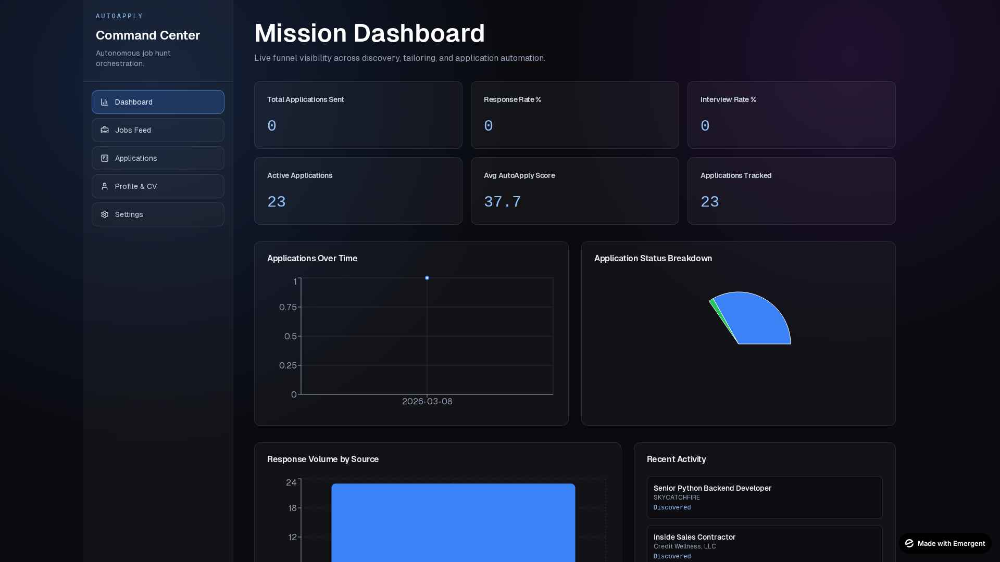
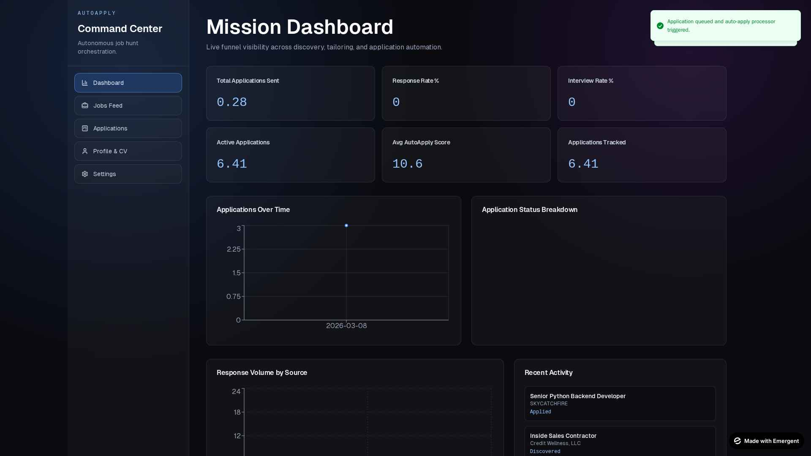

# 🤖 Auto Job Applier

An AI-powered job discovery + auto-application platform built with **FastAPI + React + MongoDB**.

🌐 **Live App:** https://auto-job-applier-xlyq.onrender.com/

---

## 🚀 What This Project Does

Auto Job Applier helps you:

1. Upload your resume (`PDF`/`DOCX`) and parse profile data with AI.
2. Discover jobs from multiple sources (Remotive, Adzuna, ATS platforms).
3. Score jobs against your profile + preferences.
4. Generate tailored resume/cover letter PDFs.
5. Queue and auto-apply via:
   - 📧 Email (Resend), or
   - 🧭 Direct apply link flow (Playwright)
6. Track outcomes in a Kanban pipeline and analytics dashboard.
7. Parse Gmail replies and auto-update application status.
8. Generate/send follow-up drafts when no response arrives.

---

## 🧩 Supported Job Sources

### General Sources
- Remotive
- Adzuna

### ATS/Structured Endpoint Sources
- Greenhouse
- Lever
- Ashby
- Workable
- Recruitee
- SmartRecruiters

All sources can be toggled on/off from Settings.

---

## 🏗️ High-Level Architecture

```text
Frontend (React)
   ├── Profile & Preferences UI
   ├── Settings (API keys, source toggles, ATS slugs)
   ├── Jobs / Applications / Dashboard
   └── Calls FastAPI Backend
                │
Backend (FastAPI)
   ├── Resume parsing + AI enrichment
   ├── Multi-source discovery pipeline
   ├── Scoring + dedupe + persistence (MongoDB)
   ├── Queue processor + retries
   ├── Direct apply (Playwright) / Email apply (Resend)
   ├── Gmail OAuth + inbox classification
   └── Scheduler (periodic discovery + queue + gmail poll)
                │
MongoDB
   ├── jobs
   ├── applications
   ├── application_queue
   ├── documents
   └── gmail_processed_messages
```

---

## ✨ Key Features

### 📄 Resume Intelligence
- CV upload and text extraction.
- AI profile parsing (skills, summary, structured profile).

### 🎯 Preference-Based Matching
- Target titles, location/remote mode, salary range, and other constraints.
- Salary normalization support (including INR/LPA-style user input).

### 🔎 Discovery + Aggregation
- Runs across enabled sources.
- Dedupes repeated jobs.
- Stores only actionable jobs (jobs with apply email or apply link).

### 🧠 AI Tailoring
- Job-specific resume + cover letter generation.
- PDF generation and download.

### ⚙️ Auto-Apply Pipeline
- Queue-based processing with retries and backoff.
- Auto-apply via email or direct-apply flow.
- Submission proof tracking (including screenshots for direct apply).

### 📬 Gmail Automation
- OAuth connect from Settings.
- Poll inbox and classify responses (`rejection`, `interview`, `offer`, `no-match`).
- Auto-status updates on applications.

### 📨 Follow-Up Assistant
- Generates follow-up drafts for stale applications.
- One-click send via Gmail API.

### 📊 Tracking Dashboard
- KPI cards, status/source breakdowns, timeline trends, recent activity.

---

## 🖼️ UI Snapshots

### Dashboard


### Core Flows


---

## 🛠️ Tech Stack

- **Frontend:** React, CRACO, Tailwind, Axios
- **Backend:** FastAPI, APScheduler, Playwright, httpx
- **Database:** MongoDB (Motor)
- **AI:** Claude (via `EMERGENT_LLM_KEY`)
- **Email:** Resend + Gmail API OAuth

---

## ⚙️ Configuration

### Backend env (`backend/.env`)
- `MONGO_URL`
- `DB_NAME`
- `EMERGENT_LLM_KEY` (optional but recommended)
- `CORS_ORIGINS` (optional)

### Frontend env (`frontend/.env`)
- `REACT_APP_BACKEND_URL`

---

## ▶️ Running Locally

### Backend
```bash
cd backend
pip install -r requirements.txt
uvicorn server:app --reload --host 0.0.0.0 --port 8000
```

### Frontend
```bash
cd frontend
npm install
npm start
```

---

## 🔌 Core API Endpoints

- `POST /api/profile/upload-cv`
- `GET /api/profile`
- `GET/PUT /api/preferences`
- `GET/PUT /api/settings`
- `POST /api/jobs/discover`
- `POST /api/jobs/discover/{source}`
- `POST /api/jobs/clear-cache`
- `GET /api/jobs`
- `GET /api/jobs/{job_id}`
- `POST /api/jobs/{job_id}/generate-documents`
- `GET /api/documents/{document_id}/download/{resume|cover}`
- `POST /api/applications/queue/{job_id}`
- `POST /api/auto-apply/run`
- `GET /api/applications`
- `GET /api/applications/kanban`
- `PATCH /api/applications/{application_id}/status`
- `GET /api/dashboard/metrics`
- `GET /api/gmail/status`
- `GET /api/gmail/oauth/start`
- `POST /api/gmail/poll`

---

## 🧭 Typical Workflow

1. Upload CV on **Profile & CV**.
2. Save preferences (titles, salary, remote mode).
3. Configure source toggles and ATS slugs in **Settings**.
4. Discover jobs (all sources or source-specific).
5. Queue/apply from **Jobs Feed**.
6. Monitor pipeline in **Applications** and **Dashboard**.
7. Use Gmail polling + follow-up tools for response handling.

---

## 📌 Notes

- Some ATS/company slugs can return `404` if the slug is invalid.
- Discovery is fault-tolerant and reports source-level errors.
- Rotate API keys if ever exposed in screenshots/logs.
